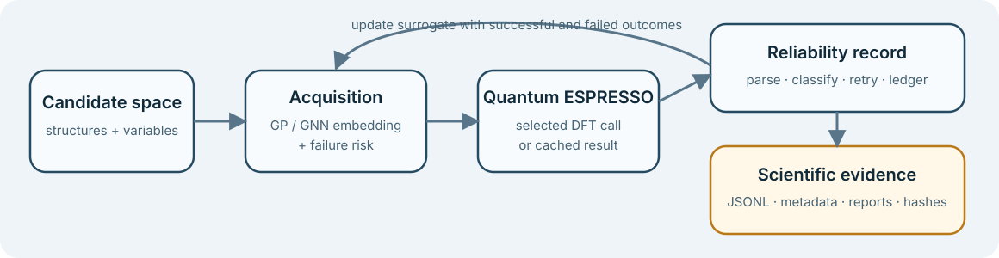

# ActiStruct

<p align="center">
  
</p>

<p align="center">
  <strong>Reliability-aware active learning for DFT structure exploration.</strong>
</p>

<p align="center">
  <a href="https://github.com/Rifat19R/ActiStruct/actions/workflows/ci.yml"></a>
  <a href="LICENSE"></a>
</p>

ActiStruct is a reliability-aware active-learning framework for selecting and
managing DFT calculations in atomistic structure exploration. It connects
Gaussian-process and GNN-embedding surrogates to Quantum ESPRESSO workflows,
records successful and failed calculations, and keeps scientific claims tied
to committed evidence.

<p align="center">
  
</p>

## Why ActiStruct

DFT geometry searches are expensive, and failures are scientifically relevant.
ActiStruct provides:

- Gaussian-process lower-confidence-bound acquisition with optional
  failure-risk penalties;
- a SchNet-style encoder with a frozen-embedding GP surrogate;
- Quantum ESPRESSO output parsing, failure classification, retry strategies,
  caching, and append-only JSONL ledgers;
- reviewer-facing benchmark protocols, reports, and provenance records;
- offline tests that never launch Quantum ESPRESSO.

The framework supports targeted exploration of known structural variables. It
is not a replacement for global structure search, convergence studies, or
expert review of DFT settings.

## Validated evidence

| Evidence package | What was completed | Supported conclusion |
|---|---|---|
| [TMC reliability benchmark](benchmarks/tmc/README.md) | 16 converged QE records for ferrocene, Ni(CO)4, Cr(CO)6, and Fe(CO)5, with parser checks, features, a GP baseline, and a retrospective AL demonstration | The pipeline operates on real QE records and preserves reliability metadata; the small dataset does not establish predictive generality |
| [Ti3C2-O LF campaign](benchmarks/ti3c2o/README.md) | GNN-embedding GP, periodic plain GP, and random tracks; five iterations per track; 14 physical DFT calls including the corrected GP rerun | In this single campaign, the corrected periodic GP found the best new result, `|DeltaG_H| = 0.0020 eV` |
| [Software validation](docs/reproducibility.md#fast-local-checks) | 467 offline tests after reorganization | Core behavior, evidence paths, parsers, and benchmark invariants are regression-tested without running QE |

The live Ti3C2-O campaign exposed two real implementation problems: GNN random
number reproducibility and periodic-coordinate/duplicate behavior in the plain
GP track. Both are documented in the frozen protocol and preserved result
record; the original failed behavior was not erased.

High-fidelity ranking validation was **attempted and deferred**. The HF
clean-slab reference did not complete in three attempts, no HF scientific
result exists, and no partial HF output supports a claim. See
[HF validation status](docs/HF_VALIDATION_STATUS.md).

## Install

Python 3.10 or newer is required. Tests are supported without Quantum
ESPRESSO.

```bash
git clone https://github.com/Rifat19R/ActiStruct.git
cd ActiStruct
python -m venv .venv
source .venv/bin/activate          # Windows: .venv\Scripts\activate
python -m pip install --upgrade pip
python -m pip install -e ".[test]"
```

Optional dashboard dependencies:

```bash
python -m pip install -e ".[dashboard]"
```

See [installation](docs/installation.md) for the conda environment, CPU-only
PyTorch, and live Quantum ESPRESSO requirements.

## Five-minute no-QE example

```bash
python examples/quickstart/no_qe_ti3c2o.py
```

The example loads the committed Ti3C2-O structure, creates adsorption-site
variants, exercises the GNN-embedding GP path, and writes only temporary
ledger data. It uses no Quantum ESPRESSO executable and does not reproduce the
live campaign.

Then run the offline suite:

```bash
python -m pytest -q
```

For a smaller reliability-acquisition walkthrough, see
[the quickstart](docs/quickstart.md).

## Inspect evidence without rerunning DFT

The fastest reviewer workflow uses committed data:

```bash
# Verify selected evidence files and campaign totals
python -m pytest -q tests/test_repository_integrity.py

# Rebuild the small-data TMC GP and retrospective AL reports
python scripts/12_baseline_model.py
python scripts/14_active_learning_demo.py
```

The checksum manifest is
[`reproducibility/evidence_sha256.txt`](reproducibility/evidence_sha256.txt).
It pins selected reviewer-facing files while Git preserves complete history.
The [reproducibility guide](docs/reproducibility.md) distinguishes software
checks, cached analysis, and live QE reproduction.

## Live QE is an explicit opt-in

Live workflows require Linux/WSL or cluster hardware, reviewed QE settings,
external pseudopotentials, and potentially hours per candidate. They are never
launched by installation or tests.

```bash
export ESPRESSO_PSEUDO=/path/to/SSSP_1.3.0_PBE_efficiency
export ESPRESSO_COMMAND="mpirun -np 2 pw.x"
```

Before a run, review `pseudo/README.md`, the benchmark protocol, expected
outputs, and hardware limits. Do not rerun expensive DFT merely to confirm
that the Python package installed correctly.

## Repository map

| Path | Purpose |
|---|---|
| `actistruct/` | Installed library: acquisition, core ledger/cache, datasets, debugging, GNN, parser, dashboard |
| `qe_active_inverse_common.py` | Installed legacy GP/LCB engine used by generated QE workflows |
| `benchmarks/` | Reviewer entry points for TMC and Ti3C2-O protocols, evidence, commands, and limitations |
| `examples/` | No-QE quickstarts, manual integration checks, and live-QE examples |
| `scripts/` | TMC pipeline, analysis, maintenance, and generated-workflow launchers |
| `data/`, `qe/`, `runs/`, `structures/` | Reference/processed data, retained inputs and outputs, and structures |
| `outputs/campaigns/` | Append-only Ti3C2-O campaign evidence |
| `reports/` | Generated and dated scientific reports |
| `reproducibility/` | Evidence hashes and tiered reproduction entry point |
| `docs/` | Current documentation, claim governance, and development history |
| `tests/` | Offline test suite; no test launches QE |

The current package is intentionally not half-migrated to `src/`: generated
workflows install and import the top-level legacy engine. The decision and
future migration boundary are recorded in the
[repository audit](docs/repository_audit/maloq_vs_actistruct.md).

## Scientific scope and limitations

ActiStruct currently supports conservative claims about:

- reliability-aware ranking behavior and its tested LCB fallback;
- the completed TMC pipeline and retrospective small-data demonstrations;
- the completed, single-system Ti3C2-O low-fidelity campaign;
- software behavior protected by the offline test suite.

It does **not** establish that GP generally beats GNN, make active learning a
universal DFT-cost reducer, confirm LF ranking at HF, or experimentally
validate any result. The Ti3C2-O comparison uses one system, one seed set, and
one campaign budget. The TMC dataset is small, and some literature-reference
checks remain below citation-grade geometry validation.

Read [scientific scope](docs/scientific_scope.md),
[limitations](docs/limitations.md), and
[claim governance](docs/claim_governance.md) before reusing a result.

## Documentation

- [Documentation index](docs/index.md)
- [Installation](docs/installation.md)
- [Quickstart](docs/quickstart.md)
- [Architecture](docs/architecture.md)
- [Benchmark index](docs/benchmarks.md)
- [Reproducibility](docs/reproducibility.md)
- [Frozen Ti3C2-O protocol](docs/BENCHMARK_PROTOCOL.md)
- [Ti3C2-O results](docs/TI3C2O_LF_CAMPAIGN_RESULTS.md)
- [HF validation status](docs/HF_VALIDATION_STATUS.md)
- [Contributing](CONTRIBUTING.md)

## Citation

If ActiStruct supports your work, cite the software using
[`CITATION.cff`](CITATION.cff). Cite the underlying DFT, ASE, and method
references appropriate to the workflow as well; the historical manuscript
bibliography is retained under `docs/manuscript/`.

## License

ActiStruct is released under the [MIT License](LICENSE).
