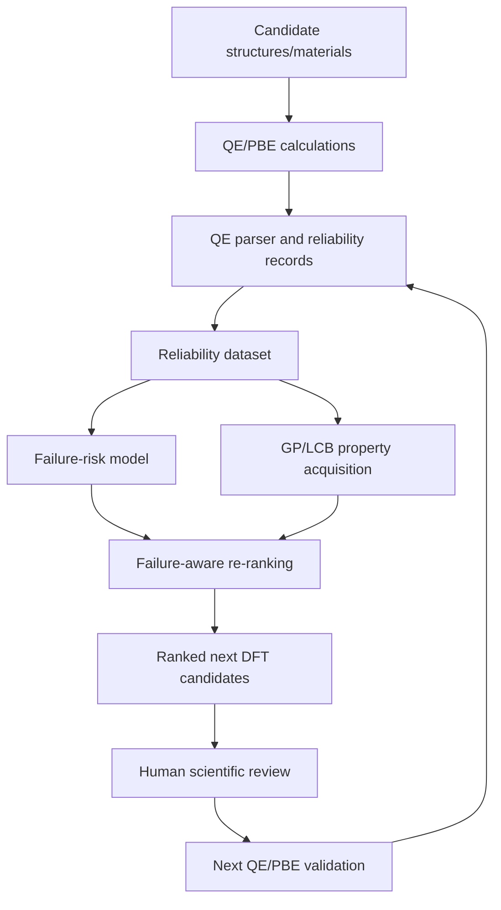

# ActiStruct v0.6 Technical Report: Reliability-Aware Active Learning for DFT-Guided Materials Discovery

**Repository state at time of writing:** branch `main`, v0.5.1 merged, `pytest -q` → 73 passed, working tree clean. No QE/DFT jobs were run to produce this report; all numbers are read directly from existing committed reports and CSVs.

---

## 1. Executive Summary

ActiStruct is an experimental reliability-aware active-learning workflow for DFT-guided materials discovery. It is built on a Gaussian-process / lower-confidence-bound (GP/LCB) active-learning engine for Quantum ESPRESSO (QE) structure optimization, and adds a reliability layer on top: a parser that records both successful and failed QE runs, a failure-risk classifier trained only on pre-run setup metadata, and a soft failure-risk penalty wired into the GP/LCB acquisition score.

Across v0.1–v0.5.1, ActiStruct has shown three consistent things, in order of strength of evidence:

1. A failure-risk classifier can reach strong in-domain accuracy (RandomForest accuracy 0.959, F1 0.966, ROC-AUC 0.990 on a random split of 976 records), but generalization to *held-out materials* is weak and highly variable (group-split failure recall ranges from 0.000 to roughly 0.776 ± 0.344 depending on threshold and modeling fix).
2. The failure-risk score can be wired into GP/LCB acquisition as a strictly soft penalty — it never hard-rejects a candidate, and it reduces to the original LCB score exactly when no risk estimate is available or when the penalty weight (gamma) is zero.
3. In a 50-trial offline stress benchmark (v0.5.1), failure-aware re-ranking reduced mean predicted failure risk in every tested candidate-pool condition, and reduced known failed selections relative to LCB-only most clearly in normal and failure-enriched pools — but not consistently in held-out-material or high-uncertainty pools.

No live QE/DFT validation of failure-aware acquisition has been performed. All evidence to date is offline, using completed records. ActiStruct does not claim to discover new materials, replace DFT, or guarantee fewer failed live QE jobs.

## 2. Problem Statement

DFT-guided materials screening spends real compute on candidates that fail before producing a usable result — bad SCF convergence, malformed input, or runtime exhaustion. Most active-learning loops for structure optimization rank candidates purely by predicted property value and model uncertainty, and treat every candidate as equally likely to finish successfully. That assumption is false in practice: certain combinations of cutoffs, k-point grids, smearing, pseudopotential families, and composition are measurably more failure-prone than others, and that information is knowable *before* a calculation is launched.

ActiStruct's problem statement is narrow and falsifiable: can pre-run setup metadata predict QE failure risk well enough to be a useful soft penalty in GP/LCB candidate ranking, without ever discarding a candidate outright or hiding failure data?

## 3. Scientific Positioning

ActiStruct is positioned as a DFT-triage aid, not a discovery engine. The governing rule, repeated throughout the codebase and reports, is:

```text
ML predicts. Uncertainty ranks. Failure risk warns. QE/PBE validates.
```

Concretely: a Gaussian-process surrogate predicts the property of interest and its uncertainty; the LCB acquisition function ranks candidates by predicted value adjusted for uncertainty; the failure-risk model contributes an additional soft warning term to that ranking; and Quantum ESPRESSO/PBE remains the sole source of validated ground truth. ActiStruct never substitutes a predicted value or a risk score for an actual DFT result, and it never deletes, hides, or relabels a failed calculation — failures are training signal, not noise to be cleaned away.

## 4. ActiStruct Workflow



Text version, for readers who do not render Mermaid:

```text
candidate structures → QE/PBE records → parser → reliability dataset →
failure-risk model + GP/LCB acquisition → failure-aware ranking →
next DFT candidate proposal → QE/PBE validation
```

The loop is intentionally circular: every QE/PBE run, success or failure, becomes a new reliability record, which can retrain the failure-risk model for the next round of candidate selection. No step in this loop currently runs without a human reviewing the proposal before the next QE/PBE submission.

## 5. Implemented Components

| Component | Location | Role |
| --- | --- | --- |
| Shared GP/LCB active-learning engine | `qe_active_inverse_common.py` | Runs the structure-optimization active-learning loop; hosts the `failure_risk_provider` hook |
| 50 generated QE benchmark workflows | `generated_models/` | Original structure-optimization benchmark the engine was built for |
| QE output parser | `actistruct/parsers/qe.py` | Parses `pw.x` output into structured records, including failures |
| Reliability dataset builder | `actistruct/datasets/qe_records.py` | Builds the committed CSV dataset from parsed records |
| Reliability classifiers | `analysis/train_qe_reliability_classifier.py`, `analysis/qe_reliability_generalization_fix.py` | Train and evaluate pre-run failure-risk models (v0.1–v0.3.2) |
| Failure-aware acquisition scoring | `actistruct/acquisition/reliability.py` | `rank_candidates()`: soft failure-risk penalty added to LCB score |
| Offline benchmarks | `analysis/simulated_failure_aware_al_benchmark_v05.py`, `..._v051.py` | Simulated, reproducible policy comparisons on completed records |

All of the above are covered by the current 73-test `pytest` suite; none of them launch QE/DFT.

## 6. Reliability Dataset and QE Parsing

The QE parser (`actistruct/parsers/qe.py`) records convergence status, job completion status, SCF iteration count, final energy (Ry and eV), total force, pressure, wall time, QE settings (cutoffs, mixing, smearing, k-points), pseudopotential filenames and inferred family, failure reason, and a calculation hash. It records both successful and failed runs by design — a failed SCF job is parsed the same way as a successful one, with the failure reason captured rather than discarded.

Current dataset (`data/parsed_records/qe_reliability_records.csv`, `reports/qe_reliability_dataset_summary.md`):

```text
Main QE reliability records:        976
Converged (success):                589
Failed/incomplete/non-converged:    387
Invalid-geometry quarantine records: 90
Total parsed local records:        1066
```

Failure-label breakdown of the 976 main records: `success` 589, `qe_error` 180, `job_not_completed` 153, `scf_not_converged` 54. Invalid-geometry records (exact or near-exact atomic overlaps caught before launching QE) are quarantined into a separate file and excluded from the reliability-modeling dataset, since they represent structure-generation bugs rather than QE/SCF reliability signal. The shared engine validates minimum interatomic distance before launching QE, so future exact-overlap candidates are rejected cheaply rather than consuming a QE job — this pre-QE geometry check is the one place ActiStruct rejects a candidate outright, and it is a deterministic geometry check, not a learned model.

The dataset spans 63 materials (per `data/qe_reliability_predictions_v032.csv`) drawn from the 50-workflow benchmark plus auxiliary builds, dominated by `co_on_pt111` (128 records), `mos2` (76), and `o_on_ni111` (70); coverage across materials is highly uneven, which is the root cause of the generalization weaknesses described in Section 7.

## 7. Failure-Risk Modeling

**v0.1 baseline (`reports/qe_reliability_classifier_v0.md`):** RandomForestClassifier trained on setup-only features (`ecutwfc`, `ecutrho`, k-points, smearing, mixing beta, pseudopotential family, species count/elements, `material_id`), explicitly excluding post-run fields (`converged`, `energy_ev`, `final_energy_ry`, `max_force`, `pressure_kbar`, `scf_iterations`, `wall_time`, `failure_reason`, `calculation_hash`, `job_done`). On a random 780/196 train/test split: **accuracy 0.959, F1 0.966, ROC-AUC 0.990**.

**v0.2/v0.3 generalization stress test (`reports/qe_reliability_classifier_v03_generalization.md`):** the same model evaluated under three splits — `baseline_random_split`, `no_material_id_random_split` (removes `material_id` to test reliance on workflow identity), and `material_group_split` (holds out whole materials). The random-split result looked strong (RandomForest failure recall 0.962 by default threshold), but the held-out-material/group split told a different story: RandomForest failure recall on the group split was **0.000** at the default threshold, and threshold tuning did not recover it. This gap — strong in-domain accuracy, near-zero held-out-material recall — is the central weakness this project has had to confront honestly rather than hide.

**v0.3.1 diagnosis (`reports/qe_reliability_group_split_diagnosis_v031.md`):** root-caused the group-split failure: true-failure records received a median predicted risk of only 0.038 — the model was assigning near-zero risk to the very failures it needed to flag, once those failures belonged to materials it had not seen in training.

**v0.3.2 fix (`reports/qe_reliability_classifier_v032_group_generalization.md`):** introduced taxonomy-specific risk models (separate balanced RandomForests for setup-error, SCF-non-convergence, and runtime-incompletion risk, combined as `1 - product(1 - component_risk)`), lower operating thresholds, and 20 repeated group splits to get a distribution rather than a single number:

```text
threshold 0.05: failure recall 0.776 ± 0.344
threshold 0.10: failure recall 0.725 ± 0.377
threshold 0.30: failure recall 0.300 ± 0.359
```

The mean improved substantially over the v0.3 group-split result, but the standard deviation is comparable to or larger than the mean at every threshold. This is the basis for treating failure risk as a **soft triage signal**, never a hard rejection rule: on some held-out materials the model will be a strong filter, and on others it will be little better than chance, and there is no current way to know in advance which case applies to a brand-new material.

## 8. Failure-Aware GP/LCB Acquisition

`actistruct/acquisition/reliability.py` implements the scoring function used everywhere failure risk meets ranking. For minimization:

```text
score = predicted_value - beta * uncertainty + gamma * failure_risk
```

with `beta = 2.0` and `gamma` set by a named mode — `mild = 0.1`, `balanced = 0.3`, `aggressive = 1.0` — or a custom override. Properties verified by the test suite:

- **Soft penalty only:** `rank_candidates()` always returns every input candidate; none are deleted regardless of risk.
- **Exact LCB fallback:** when `failure_risk` is missing for a candidate, or `gamma = 0`, the score reduces exactly to the original LCB score (`predicted_value - beta * uncertainty`), and ranking is provably identical to LCB-only even when failure-risk values vary across candidates.
- **Safe input handling:** non-numeric, empty, `NaN`, or out-of-range (outside `[0, 1]`) failure-risk values are handled without crashing (clipped or treated as missing), and `NaN`/negative uncertainty raise a `ValueError` rather than silently corrupting the ranking.
- **Rank diagnostics:** every ranked candidate carries `base_lcb_score`, `failure_penalty`, `acquisition_score`, `rank_without_failure_risk`, `rank_with_failure_risk`, `rank_shift`, `risk_flag`, and a human-readable `selection_reason`.

This scoring function is wired into the live GP/LCB proposal path in `qe_active_inverse_common.py` via an optional `failure_risk_provider` on `ActiveSystem`, with `failure_risk_gamma_mode`/`failure_risk_gamma`/`failure_risk_threshold` controls. The v0.4 demo (`reports/failure_aware_gp_acquisition_v04.md`) and v0.4.1 production wiring (`reports/failure_aware_gp_acquisition_v041.md`) both ranked 50 candidates from `data/qe_reliability_predictions_v032.csv`, with 36 flagged elevated-risk; the production version added the explicit "old LCB behavior preserved" guarantee as a tested contract rather than an informal note.

## 9. Benchmark Evidence from v0.5.0

`analysis/simulated_failure_aware_al_benchmark_v05.py` ran a single offline trial comparing `random_selection`, `lcb_only`, and failure-aware LCB (mild/balanced/aggressive) on the full natural candidate pool (`reports/simulated_failure_aware_al_benchmark_v05.md`). At top-10:

```text
LCB-only top-10 selected 0 known failures (mean predicted risk 0.152).
Failure-aware aggressive top-10 also selected 0 known failures,
  reducing mean predicted failure risk from 0.152 to 0.066.
```

Because LCB-only already selected zero known failures, **v0.5.0 cannot claim that failure-aware LCB reduced failed selections compared with LCB-only** — there was no failure count left to reduce. The only honest claim from v0.5.0 is that aggressive re-ranking lowered the *predicted risk profile* of the selected set while preserving the zero-failure outcome. This limitation — not a flaw in the method, but a limitation of testing it on one easy sample — is exactly what motivated v0.5.1.

## 10. Repeated Stress Benchmark from v0.5.1

`analysis/simulated_failure_aware_al_benchmark_v051.py` repeats the same comparison across **50 trials** and four candidate-pool modes designed to be harder than the v0.5.0 sample: `normal_pool` (plain random sub-sample), `failure_enriched_pool` (re-weighted to ~60% known failures from real records), `heldout_material_pool` (whole materials sampled together, clustering failures/successes the way a true held-out-material scenario would), and `high_uncertainty_pool` (sampled from the top-50% most uncertain candidates by the existing OOD-distance proxy). All four modes were implemented because the underlying data (`material_id`, `ood_distance`) supports them; none were skipped or faked.

Unlike v0.5.0, smaller sub-pools mean `lcb_only` no longer always avoids every known failure, which finally creates room to test whether failure-aware re-ranking helps. At top_k = 10, mean ± std over 50 trials, `failure_aware_aggressive` vs `lcb_only`:

| Pool mode | Failures: LCB-only → aggressive | Δ failures vs LCB | Risk: LCB-only → aggressive | Δ risk vs LCB |
| --- | --- | --- | --- | --- |
| `normal_pool` | 1.48±1.33 → 0.30±0.54 | −1.18±1.32 | 0.163 → 0.096 | −0.067±0.042 |
| `failure_enriched_pool` | 3.86±1.74 → 1.80±1.67 | −2.06±1.52 | 0.193 → 0.115 | −0.078±0.043 |
| `heldout_material_pool` | 0.74±1.98 → 0.62±1.51 | −0.12±1.61 | 0.129 → 0.103 | −0.026±0.056 |
| `high_uncertainty_pool` | 0.00±0.00 → 0.06±0.24 | +0.06±0.24 | 0.169 → 0.120 | −0.049±0.039 |

Mean predicted failure risk dropped under the aggressive penalty in **all four** pool modes. The failure-count picture is mixed: `normal_pool` and `failure_enriched_pool` show a clear reduction (the mean delta is several times larger than its own standard error); `heldout_material_pool`'s reduction (−0.12) is smaller than its trial-to-trial noise (std 1.61) and should be read as small/noisy, not a clear win; `high_uncertainty_pool` shows no failure-count improvement at all (the mean delta is slightly positive). A dedicated check (`gamma_zero_matches_lcb_only`) confirms gamma = 0 reproduces `lcb_only` ranking exactly, independent of the failure-risk values present, in every pool mode. Both the v0.5.0 and v0.5.1 scripts produce byte-identical CSV/report output across repeated runs with the same seed.

## 11. Benchmark Summary Table: v0.1 to v0.5.1

| Milestone | Main purpose | Files/reports | Main result | Scientific meaning | Limitation |
| --- | --- | --- | --- | --- | --- |
| v0.1 parser/dataset foundation | Parse QE outputs incl. failures into a stable dataset | `actistruct/parsers/qe.py`, `data/parsed_records/qe_reliability_records.csv`, `reports/qe_reliability_dataset_summary.md` | 976 main records (589 success / 387 failure), 90 quarantined invalid-geometry, 1066 total | Failures are preserved as first-class data, not cleaned away | Local, scratch-heavy, unevenly distributed across 63 materials |
| v0.1 reliability classifier | Predict pre-run failure risk | `reports/qe_reliability_classifier_v0.md` | RandomForest accuracy 0.959, F1 0.966, ROC-AUC 0.990 (random split) | Setup metadata alone carries real signal in-domain | One random split, not a generalization test |
| v0.2/v0.3 ablation and group split | Test reliance on `material_id` / new-material generalization | `reports/qe_reliability_classifier_v03_generalization.md` | Random-split failure recall 0.962; group-split failure recall **0.000** | Random split overestimates real-world performance | Model is unreliable on unseen materials at default settings |
| v0.3.1 diagnosis | Root-cause the group-split failure | `reports/qe_reliability_group_split_diagnosis_v031.md` | True-failure median predicted risk 0.038 | Held-out failures were scored near-zero risk | Diagnosis only, no fix yet |
| v0.3.2 repeated group-split fix | Improve held-out-material recall | `reports/qe_reliability_classifier_v032_group_generalization.md` | Failure recall 0.776±0.344 (t=0.05), 0.725±0.377 (t=0.10), 0.300±0.359 (t=0.30), 20 repeated splits | Taxonomy-specific models + lower thresholds materially improve mean recall | Standard deviation is as large as or larger than the mean — high split-to-split variance |
| v0.4 failure-aware acquisition demo | Prototype soft risk penalty in ranking | `reports/failure_aware_gp_acquisition_v04.md` | 50 candidates ranked, 36 elevated-risk | Demonstrates soft re-ranking without hard rejection | Offline integration artifact, not live GP values |
| v0.4.1 production GP/LCB wiring | Wire risk penalty into the live engine | `qe_active_inverse_common.py`, `reports/failure_aware_gp_acquisition_v041.md` | Same 50/36 ranking, with tested LCB-fallback guarantee | Old LCB behavior is preserved by contract, not convention | Still validated offline only |
| v0.5.0 offline failure-aware AL benchmark | First simulated policy comparison | `reports/simulated_failure_aware_al_benchmark_v05.md` | LCB-only and aggressive both selected 0 known failures at top-10; risk reduced 0.152→0.066 | Aggressive penalty lowers risk profile without increasing failures | Single trial; cannot show failure-count improvement since LCB-only already had none |
| v0.5.1 repeated-trial stress benchmark | Stress-test under harder, repeated pools | `reports/simulated_failure_aware_al_benchmark_v051.py`/`.md`, `data/simulated_failure_aware_al_benchmark_v051.csv` | See Section 10 table | Risk reduced in all 4 pool modes; failure count reduced clearly in 2 of 4 | `heldout_material_pool`/`high_uncertainty_pool` show weak/no failure-count benefit |

## 12. Validated vs Offline-Only Evidence

| Claim / capability | Evidence source | Status | What is validated | What remains offline-only or unproven | Safe wording | Unsafe wording |
| --- | --- | --- | --- | --- | --- | --- |
| QE parser handles completed records | `actistruct/parsers/qe.py`, dataset summary | Implemented, tested | Parses 1066 real QE records incl. failures | Coverage of every possible QE failure mode/code version | "Parser extracts reliability metadata from completed QE outputs" | "Parser guarantees every QE failure mode is captured" |
| Failure-risk model | v0.1–v0.3.2 classifier reports | Trained/evaluated on completed records | Strong in-domain accuracy; v0.3.2 improves held-out-material recall on average | High split-to-split variance; behavior on truly novel materials is unknown in advance | "Useful as a soft triage signal" | "Can reject failed DFT jobs with certainty" |
| Failure-aware GP/LCB acquisition | `actistruct/acquisition/reliability.py`, v0.4/v0.4.1 reports, test suite | Wired into proposal/ranking logic, tested offline | Soft penalty behavior, LCB fallback, safe input handling all unit-tested | Never run against a live GP/QE active-learning loop | "Penalizes predicted high-risk candidates during ranking" | "Guarantees fewer failed live QE jobs" |
| v0.5.1 repeated stress benchmark | `reports/simulated_failure_aware_al_benchmark_v051.md` | Offline simulation, 50 trials | Reduced mean predicted failure risk in all tested pools; reduced known failures most clearly in normal/failure-enriched pools | `heldout_material_pool`/`high_uncertainty_pool` failure-count benefit; any live-DFT effect | "Reduced mean predicted failure risk in all tested pools and reduced known failures most clearly in normal/failure-enriched pools" | "Proves live DFT savings" |
| Underlying GP/LCB structure-optimization engine | `analysis/DIRECT_GRID_VALIDATION.md`, direct grid checks | Validated against direct QE/PBE grids for 4 systems | Cu, MoS2, MgO, Si agree with direct grid search to <0.001 eV/atom | Generalization beyond the 4 directly validated systems and 50-workflow set | "Active-learning structure search agrees with direct grid validation for the tested systems" | "All 50 workflows are literature-validated" |
| Final materials discovery | — | Not yet validated | Candidate ranking/triage logic exists | Any claim of discovering, designing, or confirming a new material | "Supports next-candidate prioritization for human review" | "Discovers new materials" |

## 13. What ActiStruct Can Do Now

- Parse completed QE `pw.x` outputs, including failed and unconverged runs, into a stable, reproducible dataset.
- Train a pre-run failure-risk classifier from setup metadata only, with documented leakage controls.
- Rank GP/LCB candidates with an optional, tested, soft failure-risk penalty that never hard-rejects a candidate and falls back exactly to plain LCB when risk is unavailable.
- Run deterministic, reproducible offline benchmarks (v0.5.0 single-trial, v0.5.1 repeated-trial across four pool conditions) that quantify when failure-aware re-ranking helps and when it does not.
- Report all of the above conservatively, including the cases where the method does not show a benefit.

## 14. What ActiStruct Cannot Claim Yet

- That failure-aware acquisition reduces failed jobs in a **live** QE/DFT run — no live run has been performed.
- That failure risk can be used as a hard accept/reject gate — held-out-material recall variance is too large.
- That failure-aware LCB **always** outperforms LCB-only — `heldout_material_pool` and `high_uncertainty_pool` did not show a consistent failure-count benefit.
- That ActiStruct discovers new materials, replaces DFT, or generalizes to material families outside its current 63-material, QE/PBE-specific dataset.

## 15. Current Material Scope and Generalization Limits

ActiStruct is not hard-coded to a single element family. Its practical material scope is determined by available QE/PBE outputs, metadata completeness, pseudopotential availability, candidate descriptors, and similarity to existing training records, not by any architectural restriction. The current dataset already spans bulk metals, oxides, 2D materials, molecules, battery-cathode-like compounds (LiCoO2, NaCoO2, LiFePO4), and surface-adsorption systems (CO/H/O on Pt/Ni/Cu surfaces), so it can plausibly be adapted to:

- MAX phases
- MXenes
- layered oxides / battery cathodes
- surface adsorption systems
- simple catalyst/slab models
- general inorganic QE/PBE datasets

ActiStruct is **not yet validated as universally general** across unrelated materials, magnetic transition-metal systems, lanthanides/actinides, complex spin-state systems, or large MOF/catalyst spaces without more records and domain-specific tests. The v0.3.2 reliability model improved soft-triage behavior on held-out materials on average, but still showed high split-to-split variance (recall std comparable to or larger than the mean at every threshold) — any new material family should be treated as untested until its own records exist and have been evaluated, not assumed to inherit the v0.3.2 averages.

## 16. Reproducibility and Tests

The full test suite passes with no QE/DFT launched:

```text
pytest -q -> 73 passed
```

Coverage includes: QE parser and dataset-builder behavior, reliability classifier training/evaluation, failure-aware acquisition scoring (NaN/negative-uncertainty rejection, malformed/clipped failure-risk handling, soft-penalty/no-hard-rejection, LCB-fallback equivalence under gamma=0 even with varying risk), and both offline benchmarks (policy/pool-mode/top_k coverage, delta-vs-LCB columns, required output columns, report caveats and safe-claim wording). Both `simulated_failure_aware_al_benchmark_v05.py` and `..._v051.py` were verified to produce byte-identical CSV and report output across repeated runs with fixed seeds, and use OS-independent paths (no hardcoded Windows paths in source or tests).

## 17. Recommended Next Step: Live QE/PBE Validation Batch Design

**No live DFT validation has been performed in v0.6. This section is a design proposal only — it is not executed here.**

**Objective:** test whether failure-aware acquisition improves live QE/PBE candidate selection, beyond the offline evidence in Sections 9–10.

**Batch size:** 5–10 candidates.

**Candidate mix:**

- 2 exploitation candidates (best predicted value, low uncertainty)
- 2 uncertainty/exploration candidates (high GP uncertainty)
- 2 low-risk candidates (failure risk well below threshold)
- 2 failure-risk challenge candidates (failure risk near/above threshold, to test whether the penalty correctly down-ranks them)
- optional 1–2 diversity candidates (different material/composition than the rest of the batch)

**Required metadata per candidate**, to be recorded before submission and preserved regardless of outcome:

```text
candidate_id, material_id, composition/formula, candidate variables,
predicted_value, uncertainty / LCB score, failure_risk, acquisition_score,
selection_reason, DFT settings, pseudopotential family,
expected runtime/risk
```

**Go/no-go checklist** — run the live batch only if:

- desktop/HPC resources are free,
- pseudopotentials are verified,
- DFT settings are documented,
- current MXene jobs are not interrupted,
- selected candidates are scientifically meaningful,
- failed jobs will be preserved, not deleted.

If and when this batch is run, its results should be parsed through the existing reliability parser (Section 6) so they become new training/evaluation records, not a separate, disconnected dataset.

## 18. Limitations

- All reliability/acquisition evidence (v0.1–v0.5.1) is from offline analysis of completed records; no new QE/PBE jobs were run to produce it.
- Failure-risk recall on held-out materials has large variance (std comparable to or larger than the mean at every v0.3.2 threshold).
- The v0.5.x benchmarks use a constant `predicted_value = 0.0` placeholder — ranking differences come from the uncertainty proxy and the failure-risk penalty, not a live predicted-energy signal.
- Each v0.5.x candidate's failure risk is drawn from a single v0.3.2 held-out group split, not averaged across the 20 repeated splits.
- `heldout_material_pool` and `high_uncertainty_pool` did not show a clear failure-count improvement in v0.5.1.
- The dataset (976 records, 63 materials) is local and unevenly distributed; it is not yet a general-purpose DFT reliability dataset.
- No live GP/QE active-learning run with failure-aware acquisition has been performed.

## 19. Near-Term Roadmap

1. Design and, when resources allow, run the small live QE/PBE validation batch described in Section 17 — this is the gating step before any stronger claim.
2. Investigate why `heldout_material_pool` and `high_uncertainty_pool` show weaker/non-universal failure-count benefit (likely candidates: small per-trial pool sizes and the lack of a live energy signal driving `predicted_value`).
3. Continue treating failure risk as a soft triage signal; do not promote it to a hard gate until split-to-split variance is reduced.
4. Defer GNN-based surrogate modeling and other v0.7-scale feature work until step 1 produces a live validation result.
5. Do not prepare external outreach (e.g., to potential academic collaborators) until live validation evidence exists.

## 20. Final Conservative Claim

ActiStruct is an experimental reliability-aware active-learning workflow for DFT-guided materials discovery. It learns from completed QE/PBE calculations, including failures and uncertainty, to help triage candidate calculations. Its failure-risk classifier shows strong in-domain accuracy but variable held-out-material generalization, and its failure-aware GP/LCB acquisition is wired in as a soft penalty that never hard-rejects a candidate and falls back exactly to plain LCB when risk is unavailable. In repeated offline stress tests, failure-aware LCB reduced the mean predicted failure risk in all tested pool modes, and reduced known failed selections relative to LCB-only most clearly in normal and failure-enriched pools, while behavior was weaker in held-out-material pools and not universally better in high-uncertainty pools. These results support failure risk as a soft DFT triage signal, not a guarantee of live DFT savings, and no live QE/DFT validation of this method has yet been performed.
