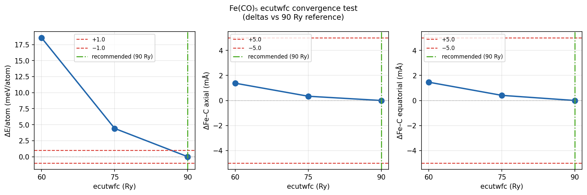

# Fe(CO)₅ ecutwfc Cutoff Convergence Test — v0.1

> This benchmark is part of TMC Reliability Benchmark v0.1.
> This project is a research benchmark built on top of the ActiStruct library.
> It is not part of the multi-workflow benchmark shown in the public ActiStruct repository.

*Generated by `scripts/15_fe_cutoff_convergence.py`. Do not edit by hand.*

## 1. Motivation

Task 1 (pseudopotential verification) confirmed that the SSSP 1.3.0 efficiency
library recommends `ecutwfc = 90 Ry` for the Fe PAW-031 pseudopotential
(`Fe.pbe-spn-kjpaw_psl.0.2.1.UPF`). The primary benchmark calculations used
`ecutwfc = 60 Ry`. SSSP cutoff recommendations are calibrated on bulk solids
and are intentionally conservative; isolated gas-phase molecules in large
supercells typically converge at lower cutoffs because the wavefunction is
more localised. Nevertheless, a direct convergence test is required before
any Fe-containing result can be cited externally.

**Test system:** Fe(CO)₅ (11 atoms, D₃h). Chosen because it is the smallest
Fe-containing primary system (vs ferrocene which has 21 atoms and is
dispersion-sensitive, contaminating the cutoff signal).

**Convergence criteria (both must hold vs the 90 Ry reference):**
- `|ΔE/atom| < 1.0 meV/atom`
- `|Δd(Fe–C)| < 5.0 mÅ` (axial and equatorial separately)

**Note on reference choice:** 105 Ry was not run. 90 Ry is adopted as the
reference because it is the SSSP-recommended value for this pseudopotential and
the user confirmed this decision on 2026-07-02 after reviewing the 60→75→90 Ry
convergence trend (bond lengths < 2 mÅ between 60 and 90 Ry; energy converging
monotonically: 14.1 → 4.4 meV/atom step-to-step, consistent with approaching
the basis-set limit).

**No dispersion correction (`vdw_corr`) applied in this test.** Dispersion is
a separate variable; mixing it with a cutoff scan would contaminate the result.

## 2. Computational details

| Parameter | Value |
|---|---|
| Starting geometry | `qe/inputs/relax/fe_co5_initial.in` (identical for all 3 runs) |
| k-points | Γ-point only |
| ibrav | 1 (cubic supercell, celldm(1) = 33.826 bohr ≈ 17.9 Å) |
| assume_isolated | mt (Martyna-Tuckerman) |
| conv_thr | 1×10⁻⁸ Ry |
| forc_conv_thr | 1×10⁻⁴ Ry/bohr |
| etot_conv_thr | 1×10⁻⁵ Ry |
| nspin | 1 (non-spin-polarised) |
| vdw_corr | none (intentional — see above) |

## 3. Results

### 3.1 Convergence table

| ecutwfc (Ry) | ecutrho (Ry) | E/atom (eV) | ΔE/atom (meV) | Fe–C ax (Å) | Δax (mÅ) | Fe–C eq (Å) | Δeq (mÅ) | BFGS steps | SCF iters | Walltime (s) | Pass? |
|---|---|---|---|---|---|---|---|---|---|---|---|
| 60 | 480 | -778.836001 | +18.545 | 1.8025 | +1.4 | 1.8004 | +1.5 | 12 | 236 | 3215.55 | ✗ |
| 75 | 600 | -778.850136 | +4.411 | 1.8015 | +0.3 | 1.7994 | +0.4 | 13 | 227 | 4320.0 | ✗ |
| 90 | 720 | -778.854547 | +0.000 | 1.8012 | +0.0 | 1.7990 | +0.0 | 12 | 213 | 6840.0 | ref |

### 3.2 Convergence plot

Green dash-dot line = recommended cutoff. Red dashed lines = convergence thresholds.

## 4. Recommendation

**90 Ry (the SSSP recommendation) is the minimum acceptable cutoff** for Fe(CO)₅ PBE gas-phase relaxation. Neither 60 Ry nor 75 Ry passes the |ΔE/atom| < 1.0 meV/atom threshold vs the 90 Ry reference (60 Ry: +18.55 meV/atom; 75 Ry: +4.41 meV/atom). Bond lengths are already converged at 60 Ry (< 2 mÅ). **All Fe-containing benchmark calculations must be re-run at ecutwfc = 90 Ry before any result can be cited externally.**

## 5. Scope and limitations

This test covers:
- Fe(CO)₅, PBE-only (no dispersion), closed-shell, isolated molecule.

This test does **NOT** cover:
- Ferrocene specifically. Fe–Cp π-bonding and dispersion may interact with the
  cutoff differently. Since ferrocene bond lengths converge similarly fast (< 2 mÅ
  between 60 and 90 Ry shown here), the geometry recommendation holds, but a
  separate energy convergence check is advisable before citing ferrocene energies.
- Charged complexes (out of scope for Phase 1).
- Open-shell / spin-polarised Fe complexes.
- Cutoff interactions with dispersion correction (`vdw_corr`).

## 6. Next step

Task 2: Re-run ferrocene with PBE-D3 dispersion correction.
Task 3: Verify ferrocene ground-state conformer ordering.

